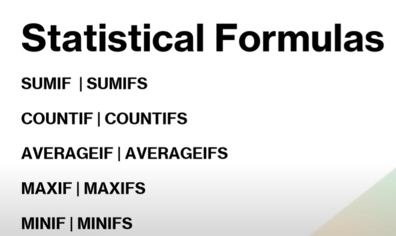

# Basic triks

following tutorial:

https://www.youtube.com/watch?v=XbyiTh-6k9Q&t=18190s

### Generating Random numbers to fill a call range:

1. select top left cell and use formula    **=RANDBETWEEN(start, stop).**

1. then to continue filling right: press Ctrl + R
2. continue filling down all rows : press Ctrl + D

### Removing formula from sheets and only keeping values

It is an importance practice to follow when we are sharing our sheet with someone else, and we do not wish for our formula (that we worked hard on) to be easily visible to the other person, and sharing ethics as well. We must share only the data so that no formulas are visible in the formula bar when you tap on any cell.

1. Select all the cells of data, entire range.
2. click copy
3. do special paste, and select paste only values.

<aside>
💡

do it with our previous random data as well, since it is dynamic, it keeps on changing.

</aside>

### Relative reference vs Absolute reference

There are two types of cell references: **relative** and **absolute**. 

Relative and absolute references behave differently when copied and filled to other cells. 

Relative references **change** when a formula is copied to another cell. Absolute references, on the other hand, remain **constant** no matter where they are copied.

By default, all cell references are **relative references**.

When copied across multiple cells, they change based on the relative position of rows and columns. 

For example, if you copy the formula **=A1+B1** from row 1 to row 2, the formula will become **=A2+B2**

There may be times when you do not want a cell reference to change when filling cells. 

Unlike relative references, **absolute references** do not change when copied or filled. 

You can use an absolute reference to keep a row and/or column **constant**.

An absolute reference is designated in a formula by the addition of a **dollar sign ($)** 

before the column and row. If it precedes the column or row (but not both), it's known as a **mixed reference**.

### Conditional Formatting

Conditional Formatting in Excel enables you to the cells with certain color depending on the condition.

[https://www.notion.so](https://www.notion.so)

[https://encrypted-tbn0.gstatic.com/images?q=tbn:ANd9GcRsqyXf94rUQHimsBnzWy0gq3s18Aw6A7gKJw&s](https://encrypted-tbn0.gstatic.com/images?q=tbn:ANd9GcRsqyXf94rUQHimsBnzWy0gq3s18Aw6A7gKJw&s)

can be used for highlighting a particular value ina table (can be made to change dynamically) and highlighting top 5 values, or bottom, cells containing text, etc.

## Data cleaning and preparation

### 1. Removing duplicates

I. removing entire rows that are duplicated.

      i. select the entire data range you're working with.

ii. go to the function.

iii. select all columns to consider

II. for removing values in a certain column only, iee not the entire row is duplicated but only a few values.

1. select the entire data range you want to work with.
2. select  the column you want to consider that have duplicate values
3. then proceed.

### 3. Removing Blank Rows

for example:

I. Ctrl + G, to find search box, then select goto special option.

II. then select blank from there

III. It will select all the blank rows in the sheet, or in the selected range of data.

IV. The do Ctrl+ - minus to delete those rows, entire row/select shift upwards.

### 3. Removing blank spaces

I. Check for the cell content using LEN formula as:

**=LEN(A1) ,**  then see if there's any anamoly, we must remove whitespace before and after the cell contents as well as they might interfere in later calculations.

II. use TRIM function to removing both leading and trailing spaces.

**=TRIM(A2)**

<aside>
💡

for unbreakable spaces: “is **a character that prevents automatic line breaks at its position**. It's useful for keeping phrases like "10 km" or "Mr. Smith" together on the same line.”

</aside>

we use **=subsitute(where,what,with what)**  replace/subsitiute that space/sppecial character with an empty string.

### Data splitting in a column/Flash Fill

for example we have city and pincode separated by a dash, we can use flash fill in excel (Ctrl + E) 

fill in the first value into the next column and then press ctrl + E t flash fill the rest of the cells.

<aside>
💡

in google sheets we have automatic smart fill that recognises pattern, Ctrl+ Shift + Y

</aside>

We can also do this by using formulas so that our changes are dynamic, and change when change in data.

**=FIND(”what”,”whithin what”,”starting from”)**

=FIND(”-”,A2,1)

then nest it within LEFT or RIGHT

### Data Validation

to validate the data already present or to ensure right data is being entered while entering records.

I. Select the column you want to validate.

II. Data tab, then Data tools, and data validation.

 

III settings tab and select the parts

### Sorting

Go to the DATA TAB and then to sort and filter. open up the sort he filter dialogue box.

I. Select all data

II. from the drop down select the column you want to sort on.

<aside>
💡

for multi level sorting, e,g sort first by name of products then the sales amount in each category.

</aside>

 **Sort function**

---

**=SORT(array, [sort_index], [sort_order], [by_col])**

array is the range of data, sort index, select the entire data

sort order is   the column no. you want to sort on, starts from 1,2,3…

sort order is 1:ascending , -1 : descending, default=descending

### SPILL ERROR (#SPILL!)

error occurs when a formula is designed to return multiple values (a spilled array) but is blocked from doing so by existing data that is present in the space that it is to be filled.

This typically happens with dynamic array formulas, which automatically expand to fill the necessary cells. For e.g.while applying sort , and you have nay thing else present in the space where the values gets copied, it give an spill error.

### Filter

a filter allows you to better analyze your data. When data is filtered, only rows that meet the filter criteria will display and other rows will be hidden. With filtered data, you can then copy, format, print, etc., your data, without having to sort or move it first.

helps us to view a specific data to help better analyse or visulause our data, for eg it can be applied to a city column to view specific cities, or for numeric columns we can also apply filters like greater than etc

**filter function**

=FILTER (range, condition 1, condition 2…)

