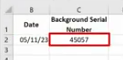

# Logical Functions

these are used when we need to execute a function or piece of code under certain conditions only.

For e.g. if you need to find out if any of the sales staff are entitled to a monthly bonus as a reward for exceeding their sales targets. You can help Lucas to identify which sales team members deserve a bonus by using an IF function formula as :

### Operators

Now for more complicated decision making, we used the concept of nested if, and ifs. as shown below.

to avoid nesting for confusion use the simpler ifs function

Eg. for nested if: we have 3 bonus bands,  over 20k, over 10k, and under 10k

so we use nested if, if it is true assign that bands value, if false then make use of another if nested inside and recheck  the value and continue as shown

for ifs, we only have two arguments, a logical test or check condition and value if true as shown

[Why You Should Use Excel IFS Function -  Don't Use Nested IF](https://www.youtube.com/watch?v=mX0-BlsDVRU)

if is often combined with AND and OR, to improve functionality ad real world applications like for example when we have to check for multiple check conditions or logical test we can combine them using AND or OR as shown in the example below.

If both logical tests are true, the **IF** function generates a message of **On** Target. If one of the values is not over 200, the **IF** returns a result of Target not Met.

**=IF(AND(A2>200,B2>200),"On Target","Target Not Met")**

By including the **AND** function as the first argument for the **IF** function, Excel can test for two criteria simultaneously.

### SUMIF

is used when we need a total that only includes values that meet a specified condition.

=sumif( range that has criteria, criteria, values to be summed)

**=SUMIF(B2:B24,”seattle”,G2:G24)**

### AVERAGEIF

It works out an average of values on rows that match a specific condition.

**=AVERAGEIF(B2:B24,"seattle",G2:G24)**

### COUNTIF

**COUNTIF** function works through a range of cells and identifies all entries that match the specified condition. It then returns a count of how many occurrences it has found. 

**COUNTIF** only requires two arguments:

- The range of cells to examine,
- And the condition to search for.

**=COUNTIF(B2:B24,”seattle”)**

[[https://docs.google.com/spreadsheets/d/16lSt3vvZ0sB-1Pho5742026P2bBEJKNh3FMluE-K4PY/edit?usp=sharing](https://docs.google.com/spreadsheets/d/16lSt3vvZ0sB-1Pho5742026P2bBEJKNh3FMluE-K4PY/edit?usp=sharing)](https://docs.google.com/spreadsheets/d/16lSt3vvZ0sB-1Pho5742026P2bBEJKNh3FMluE-K4PY/preview?usp=sharing)